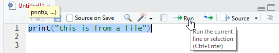

#Basic- Tour of RStudio
## Goals

### Project
### Console
### Vectors
### Variables
### Source
### Files
### Packages
### Help
### Viewer
### History
### Intellisense
### Cheat Sheets

#Create a New Project


If you know GIT you can create a GIT Repository but everyone should check "Open in new Session.""

#Project Created

You should see your project and the R Studio interface.


#Console

The console is like DOS in Windows and Terminal in Mac or an SSH Shell.

```{r}
print("Hello IT Summit")
```

Let's create a new file.

 
 This is the source view.
Type "print("this is from a file"). Then click control (command for Mac) + Enter.

You can also highlight the line and click the Run button as seen below.


You can then rerun the same line by using (Control-Shift-P) or click the rerun button.


You can then change the line to read "There has been a change" and use (Control-Shift-P) and it will rerun the same line. This is a useful technique to use as you are tweaking code to get it exactly right. 
```{r}
print("There has been a change")
```
Go ahead and save the file and look at the Files tab on the right. 


Click over to the package tab just to the right of the file tab.


# What is a package?
“Packages are collections of R functions, data, and compiled code in a well-defined format. The directory where packages are stored is called the library. ”-Quick R Web Page (https://www.statmethods.net/interface/packages.html)

- Excel -> R Function =same idea
- Data   -> values in a defined format
- Compiled code-> just means R can run it

#There are many ways to load a package.
- You can use the Install on the package tab.
- You can use the library command.
```{r}
library(ggplot2)
```
You can also use "lib.loc" to specify the path to the R version you can currently using.

This can useful when you run packages on the University HPC. 

#There are many ways to install a package.
You can click the install package icon in the Packages tab.


You can download a package from the web and install from a local zip file.


Someone hasn't told R Studio that red is the color of an error. 

Look through the Packages tab and try installing some packages.

