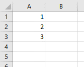
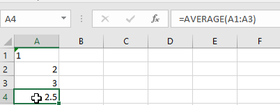
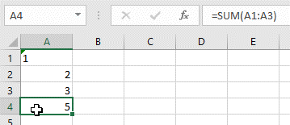
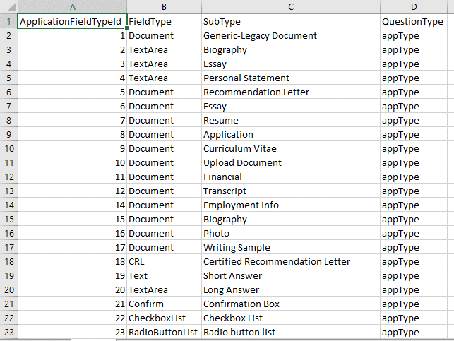
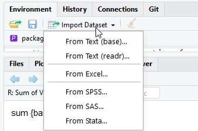
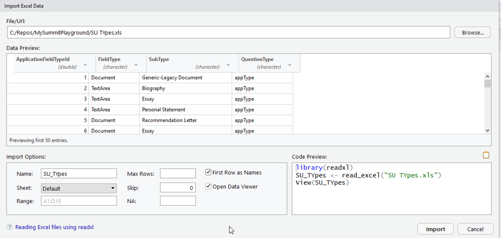
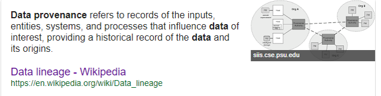
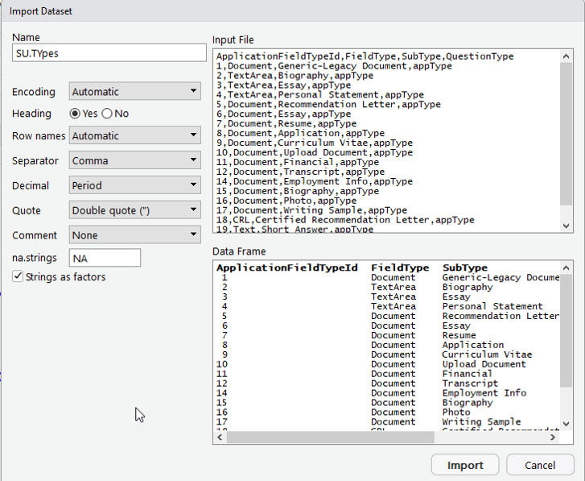
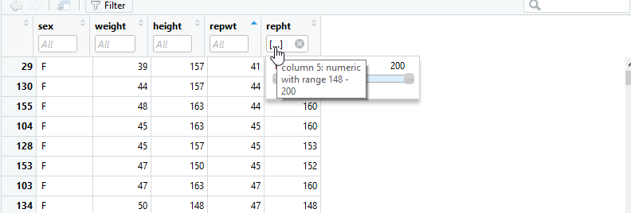
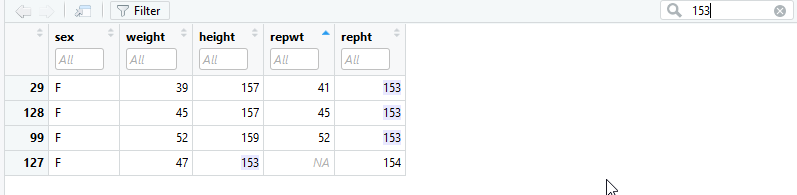

#Module 2 Goals
- Data Types
- Vectors
- Matrixes
- Lists
- Tibbles and DataFrames
- Import and Export Data
- Data Provenance
- Viewing Data in R
- Display columns of DataFrames

#Understanding R from Excel
```{r}
c(1,2,3)
```
Vector in Excel
3 rows in 1 column



#Type in Excel vs. R
- Ignores text
- In R converts to first value
```{r}
c(1,2,3)
myNumbers <- c(1,2,3)
myNumbers * 2.2
sum(myNumbers)
typeof(myNumbers[3])
myJunk <- c("1",2,3)
typeof(myNumbers[3])
mean(myJunk)
mean(as.numeric(myJunk))

```



#Vectors in R
Allow quick transformations
```{r}

sum(myNumbers)
typeof(myNumbers)
mean(myNumbers)
myDecimals <- c(1.0,2.3,3.4)
sum(myNumbers)
typeof(myDecimals)
myDecimals <- as.numeric(myDecimals)
sum(myDecimals)
typeof(myDecimals)
is(myDecimals)
is(myNumbers)
```

#Can run operations on each item

Vector operations like multiply
```{r}
myNumbers * 2.2
```


Different from aggregates like sum
Summarize into single value (vector of 1)
```{r}
sum(myNumbers)
```


#na =NULL
```{r}
badBoyz <- c("A",1,32)
is.numeric(badBoyz)
as.numeric(badBoyz)
sum(as.numeric(badBoyz), na.rm = TRUE)
```

#Matrix


```{r}
myMatrix <- c(c(2,3,4),c(6,3,5))
myMatrix

```
```{r}
myMatrix <- matrix(myMatrix, nrow = 3, ncol = 2)
myMatrix
```

- Excel is Column-Row (B2)

- R is row-column[3,2]
#Mo’ Matrix
- Can get rows or columns
- Result is vector
```{r}
sum(myMatrix)
```
```{r}
myMatrix[,1]
```
```{r}
myMatrix * 4
```
```{r}
myMatrix[1,]
```


#Tables in Excel =DataFrame in R

#DataFrame$ColumnName
```{r}
data.frame(myMatrix)
colnames(myMatrix) <- c("First Column","Second Column")
myMatrix
```
```{r}
myMatrix <- data.frame(myMatrix)
typeof(myMatrix$First.Column)
```

#Import data from Excel


#We now have a tibbles
(Note this only shows up in the Script view and not in the R Markdown view. I am not sure why)
```{r}
library(readxl)
SU_TYpes=read_excel("../../Data/SU TYpes.xls")
str(SU_TYpes)
```
```{r}
SU_TYpes[1,1]
```
```{r}
 
SU_TYpes[1,]
```
```{r}
SU_TYpes[,1]
```
 

(not a whole lot different but better for technical reasons of conversion)
#Factors =categorical variables
```{r}
factor_set <- SU_TYpes
factor_set$ApplicationFieldTypeId <- as.factor(factor_set$ApplicationFieldTypeId)
str(factor_set$ApplicationFieldTypeId)
```

#Data Provenance
- Excel is destructive
- Make changes =changes data
- R can keep original data
- If make mistakes can rerun the script


#Other Data Imports- Read(base)

#Write and read data csv
```{r}
write.csv(SU_TYpes,"mycsv.csv")
SU_TYpes_from_disk <- read.csv("mycsv.csv")
str(SU_TYpes_from_disk)
```

#Ways to view data
```{r}
str(SU_TYpes)
```
```{r}
summary(SU_TYpes)
```

#Subseting and filtering
```{r}
subset(SU_TYpes,ApplicationFieldTypeId > 5)
```
```{r}
library(dplyr)
filter(SU_TYpes, FieldType =="Document")
```


#More ways to view data
```{r}
head(SU_TYpes)
```
```{r}
tail(SU_TYpes)
```

#Filter in View mode



#Functions vs Sub
- Functions return a value
- In R have return statement in parens
```{r}
first_function <- function(x){return (x)}
first_function("x")
```

- Can be on multiple lines
```{r}
snoopdogit <-
  function(x){
    return (paste(x,"izzle",sep=""))
    }
snoopdogit("sing")
```

#Make your own functions
```{r}
fixemplid <- function(x){
  
  if (nchar(x)=="6"){
    return (paste("00",x, sep=""))
  }
   

}
fixemplid(("123456"))
```

#Pro advice
- Do 1 thing
- Verify it works (Check it in)
- Do the next thing
#Make it better
```{r}
fixemplid <- function(x){
  
  if (nchar(x)=="6"){
    return (paste("00",x, sep=""))
  }
  if (nchar(x)=="7"){
    return (paste("0",x, sep=""))
  }
  return (x)

}
fixemplid(("123456"))
```

```{r}
three_emplids <- c("123456","1234567","12345678")
lapply(three_emplids, fixemplid)
```

