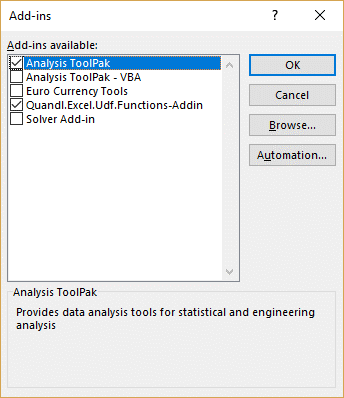
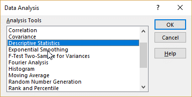
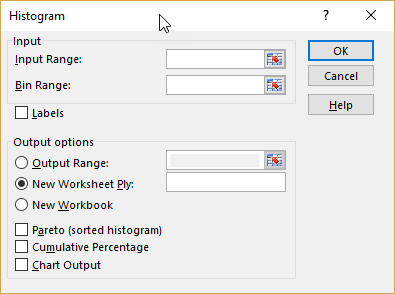
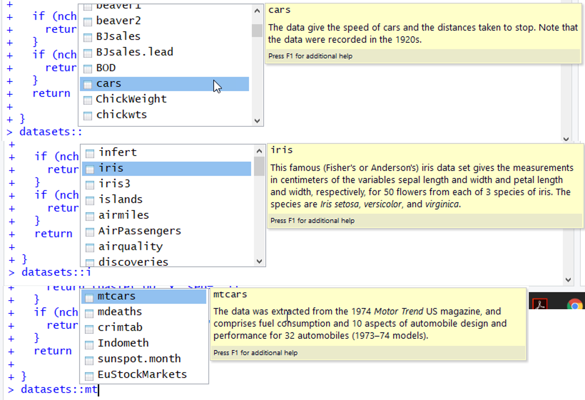

```{r setup, include=FALSE}
knitr::opts_chunk$set(echo = TRUE)
```

#Module 3 Goals
- Common datasets in R
- Aggregate Functions
- Common statistical functions
- How to use Apply and Lapply
- How to do linear regression
#Excel has Analysis add-on



#Let’s start with common datasets::

#cars
- summary
- str
```{r}
summary(cars)
```
```{r}
str(cars)
```

# Using an aggregate function

```{r}
sum(cars)
```
```{r}
mean(cars)
```
```{r}
is(cars)
```
```{r}
typeof(cars)
```
```{r}
mean(cars$speed)
```
```{r}
mean(cars$dist)
```
```{r}
apply(cars, 2, mean)
```
```{r}
apply(cars,1,mean)
```

#Common stat functions
- Mode is not present
- But easy to create	

```{r}
getmode <- function(v) {
  uniqv <- unique(v)
  uniqv[which.max(tabulate(match(v, uniqv)))]
}
apply(cars, 2, getmode)
```

#Max and Min and Range
```{r}
max(cars)
```
```{r}
apply(cars,2,max)

```

```{r}
range(cars)
```
```{r}
apply(cars,2,range)
```

```{r}
apply(cars,2,cumsum)
```


#Variance, Standard Deviation, and Correlation
```{r}
var(cars)
```
```{r}
cor(cars)
```
```{r}
apply(cars,2,sd)
```
```{r}
library(datasets)

#Load data "mtcars":
data(mtcars)
#str(mtcars)
cor(mtcars)

```


#Diff function
```{r}
apply(cars,2,diff)
```

#Sampling

```{r}
sample(cars$speed,size = 10)
```
```{r}
apply(cars, 2, sample,10)
```

#T-test
```{r}

library(dplyr)
sample1 <- apply(cars, 2, sample, 10)
sample2 <- apply(cars, 2 , sample, 10)
t.test(sample1, sample2)
```
```{r}
s1 <- sample(cars$speed, 2,   25)
s2 <- sample(cars$dist, 2,   25)
t.test(s1, s2)
```

#Rank-Column, Apply and Lapply
```{r}
rank(cars$speed)
```
```{r}
cars$speed
```
```{r}
apply(cars,2,rank)
```
```{r}
lapply(cars,rank)
```
```{r}
car_rank_list <- lapply(cars,rank)
car_rank_list$speed
```

#table
```{r}
apply(cars,2,table)
```

#Linear Regression
```{r}
lm(mtcars$mpg ~ mtcars$cyl)
```
```{r}
summary(lm(mtcars$mpg ~ mtcars$cyl))
```
```{r}
lm(mpg ~ cyl, data=mtcars)
```

#Multivariate Linear Regression
```{r}

```

#Other multiple regressions
```{r}
summary(lm( mpg ~ ., mtcars))
```
```{r}
summary(lm( mpg ~ cyl + hp, mtcars))
```
```{r}
summary(lm( mpg ~ cyl + I(hp^2), mtcars))

```

#Dummy Variables
```{r}
mtcars$cyl
```
```{r}
mtcars$cyl > 4
```
```{r}
mtcars["dummyvariable"]=mtcars$cyl > 4
summary(lm( mpg ~ ., mtcars))
```

#Prediction
```{r}
model.1 <- lm( mpg ~ ., mtcars)
predict(model.1,mtcars[1,])
```
```{r}
model.1$residuals[1]
```

#Stats Cheat Sheet
https://cran.r-project.org/doc/contrib/Short-refcard.pdf

