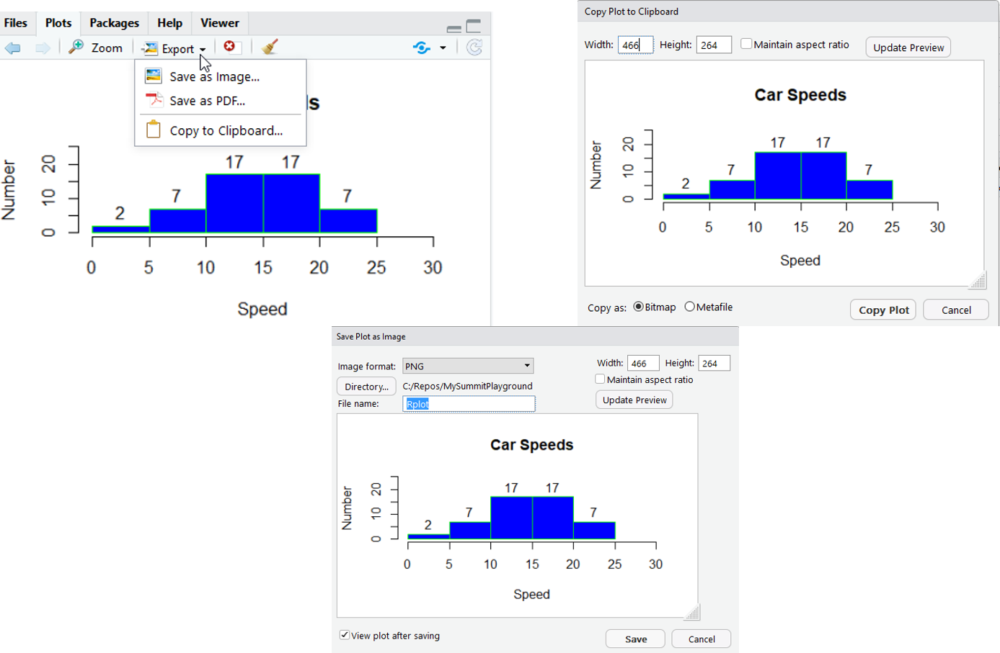

```{r setup, include=FALSE}
knitr::opts_chunk$set(echo = TRUE)
```

#Module 4 Goals
- Graphical packages for R
- Main statistical plots
- How to save images you create

#R has lots of graphical packages
- lattice
- ggplot
- Cheat Sheet for ggplot
- It is complicated -> Another module
- We’ll start with lattice
#EDA 
Exploraty Data Analysis

John Tukey

#Demo
This will open up a page with all the demos available.
```{r}
demo()
```
```{r}
demo(image)
```

#Demo (plotlib)
```{r}
demo(graphics)
```

#histogram
```{r}
hist(cars$speed)
```
You can just get the data also
```{r}
hist(cars$speed,plot=FALSE)
```
```{r}
hist(cars$speed, main="Car Speeds")
```


```{r}
hist(cars$speed, main="Car Speeds",xlab="Speed",ylab = "Number",border="green",col="blue",labels=TRUE,ylim = c(0,25), xlim=c(0,30))
```

Export graphics

#plot
```{r}
plot(cars)
```
```{r}
plot(iris)
```
```{r}
plot(iris[1:3])
```
```{r}
plot(cars$speed)
```
```{r}
plot(mpg ~ ., data=mtcars)
```


#Stem and leaf
```{r}
stem(cars$speed)
```
```{r}
stem(cars$dist)
```

#abline example
http://www.sthda.com/english/wiki/abline-r-function-an-easy-way-to-add-straight-lines-to-a-plot-using-r-software

```{r}
par(mgp=c(2,1,0), mar=c(3,3,1,1))
# Fit regression line
require(stats)
reg<-lm(dist ~ speed, data = cars)
coeff=coefficients(reg)
# equation of the line : 
eq = paste0("y = ", round(coeff[2],1), "*x ", round(coeff[1],1))
# plot
plot(cars, main=eq)
abline(reg, col="blue")
```

#boxplot
```{r}
boxplot(mpg~cyl,data=mtcars, main="Car Milage Data",xlab="Number of Cyclinders",
        ylab="Miles Per Galllon")
```
```{r}
clm <- c("mpg","wt","cyl")
summary(mtcars[clm])
```

#density

```{r}
d <- density(mtcars$mpg)
plot(d, main="Kernal Density Miles Per Gallon")
polygon(d, col="red",border="blue")
```
#dotchart
```{r}
dotchart(mtcars$mpg,labels=row.names(mtcars),cex=.7,
         main="Gas Mileage for Car Models",xlab = "Miles Per Gallon")
```


#scatterplot
```{r}
library(car) 
scatterplot(mpg ~ wt | cyl, data=mtcars, 
  	xlab="Weight of Car", ylab="Miles Per Gallon", 
   main="Enhanced Scatter Plot", 
   labels=row.names(mtcars))
```
#pairs (Scatterplot Matrices)
```{r}
pairs(~mpg+disp+drat+wt,data=mtcars, 
   main="Simple Scatterplot Matrix")
```


Look at more: https://www.statmethods.net/graphs/scatterplot.html

