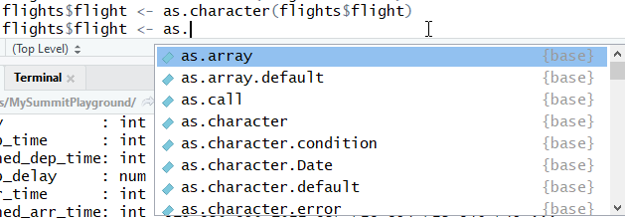
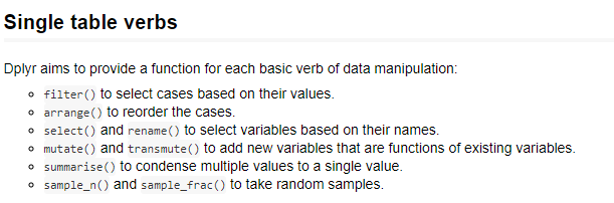
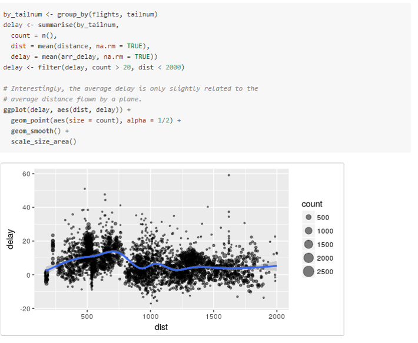
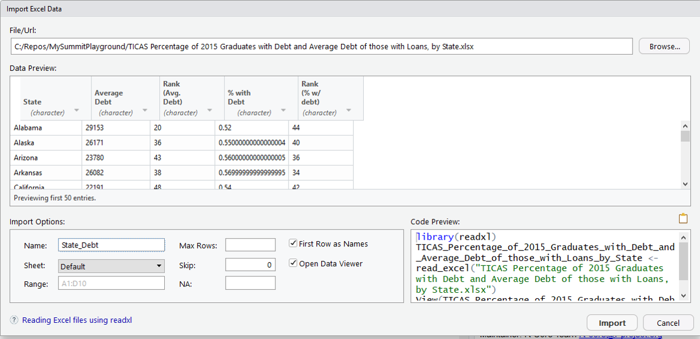
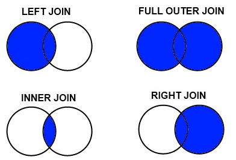
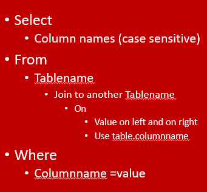
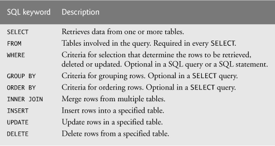

```{r setup, include=FALSE}
knitr::opts_chunk$set(echo = TRUE)
```

# Module 5 Goals
- What is dplr?
- What is dplyr a good data solution?
- What are single table functions in dplyr?
- What are aggregate functions in dplyr?
- What are the different joins?
- What is dfsql?

#dplyr
- Package to manipulate data similar in consistent way

- Table is tibble

- After transformation is still tibble

- Other packages : Matrix ->operation >Vector
- Consistency allows tricks
#These are the same
```{r}
library(dplyr)
tbl_df(mtcars) %>% 
  filter(cyl=="8cyl") %>%
    arrange(hp) %>%
    select(hp,am,gear) %>%
    unique()

```
And 
```{r}
mtcars2 <-tbl_df(mtcars)
mtcars2 <- filter(mtcars2, cyl=="8cyl" )
mtcars2 <- arrange(mtcars2,hp)
mtcars2 <- select (mtcars2,hp, am,gear)
mtcars2 <- unique(mtcars2)
mtcars2
```

Assumes results is first parameter to next function
# flights
https://cran.r-project.org/web/packages/dplyr/vignettes/dplyr.html
```{r}
#install.packages("nycflights13")
library(nycflights13)
```
```{r}
str(flights)
```

#What items are incorrect type?
- What is a type?
- How about year, month, and day?
- What are pros and cons?
- How about carrier, origin, and dest?
- What are pros and cons?
#Converting type for data

#dplyr operations on one table

#Group operations

```{r}
library(ggplot2)
by_tailnum <- group_by(flights, tailnum)
delay <- summarise(by_tailnum,
  count = n(),
  dist = mean(distance, na.rm = TRUE),
  delay = mean(arr_delay, na.rm = TRUE))
delay <- filter(delay, count > 20, dist < 2000)

# Interestingly, the average delay is only slightly related to the
# average distance flown by a plane.
ggplot(delay, aes(dist, delay)) +
  geom_point(aes(size = count), alpha = 1/2) +
  geom_smooth() +
  scale_size_area()
```

#Combing columns
```{r}
state_data <- tbl_df(datasets::state.x77)
state_abb <- tbl_df(datasets::state.abb)
state_name <- tbl_df(datasets::state.name)
state_geo_center <-tbl_df(state.center)
final_state <- cbind(state_abb,state_name)
colnames(final_state) <- c("Abbreviation","LongName")
final_state <-cbind(final_state,state_geo_center)
final_state <- cbind(final_state, state_data)
glimpse(final_state)
```

#Getting data to join

https://data.world/ian/united-states-university-rankings/workspace/file?filename=TICAS+Percentage+of+2015+Graduates+with+Debt+and+Average+Debt+of+those+with+Loans%2C+by+State.xlsx

```{r}
library(readxl)
State_Debt <- read_excel("../../Data/Ticas.xlsx")

```

#Joining tables

- Iinner_join
- left_join
-right_join
- full_join

Think about it first
```{r}
glimpse(final_state)

```
```{r}
glimpse(State_Debt)
```

How many records on inner join vs. full join?

#Inner join
```{r}
glimpse(inner_join(final_state,State_Debt, by=c("LongName"="State")))
```


#Left join
```{r}
glimpse(left_join(final_state,State_Debt, by=c("LongName"="State")))
```

#Right join
```{r}
glimpse(right_join(final_state,State_Debt, by=c("LongName"="State")))
```
 
#Full Join 
```{r}
glimpse(full_join(final_state,State_Debt, by=c("LongName"="State")))
```
 
#Seamless inner join
If name is the same will auto connect
```{r}
final_state <- rename(final_state, "State"=LongName)
head(final_state)
glimpse(full_join(final_state,State_Debt))  
glimpse(full_join(final_state,State_Debt,by="State"))
```


#sqldf
- Can translate to sql 
- Allows for multiple table join
```{r}
#install.packages("sqldf")
library(sqldf)
sqldf("select Abbreviation,Population from final_state 
      inner join State_Debt 
      on final_state.State=State_Debt.State
      
      ") 
```

#SQL Keywords



Select

Column names (case sensitive)

From

Tablename

Join to another Tablename

On


Value on left and on right

(Use table.columnname)

Where

Columnname =value

