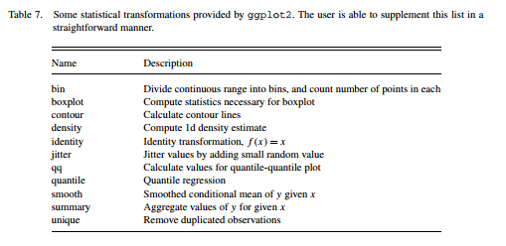
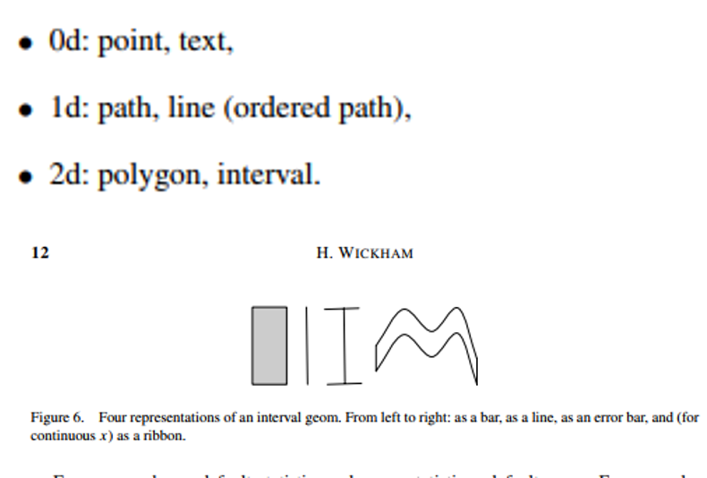
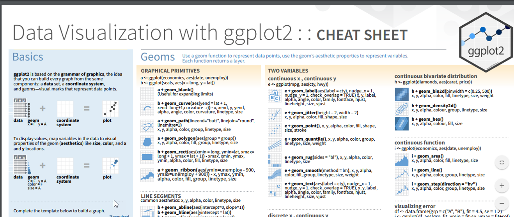

```{r setup, include=FALSE}
knitr::opts_chunk$set(echo = TRUE)
```

# Module 6 Goals
- What is the Grammar of Graphics in ggplot?
- What is the central metaphor?
- Why are ggplot graphics more difficult to create at times?
- What is a fast way to create ggplot graphics?
- What is a facet?

# What is Grammar of Graphics?
- Different components to graphics
- Data and aesthetic mappings
- Geometric objects
- Scales
- Facet specifications
- Statistical transformations
- Coordinate system
#Graphics are built upon layers
- Data and mapping
- Statistical transformation

http://byrneslab.net/classes/biol607/readings/wickham_layered-grammar.pdf


#Example Time
```{r}
library(ggplot2)
ggplot() +
layer(
data = diamonds, mapping = aes(x = carat, y = price),
geom = "point", stat = "identity", position = "identity"
) +
scale_y_continuous() +
scale_x_continuous() +
coord_cartesian()
```
#Let's break this down
- ggplot ->create new graphic object
- + layer( …) -> add a layer
- The data is diamonds dataset
- Map carat to horizontal 
- Map price to vertical
- geom -> display as points in the given position
- These are continuous points
- Use a Cartesian coordinate system
- Another way to write it
```{r chunk_name, results="hide",fig.show='hide'}
ggplot(diamonds, aes(carat, price)) +
geom_point()
```

#Geometric objects

#qplot
```{r}
qplot(carat, price, data = diamonds,
geom = c("point", "smooth"),
  log = "xy"
)
```

#qplot facets
```{r}
# From 
# create factors with value labels 
mtcars$gear <- factor(mtcars$gear,levels=c(3,4,5),
  	labels=c("3gears","4gears","5gears")) 
mtcars$am <- factor(mtcars$am,levels=c(0,1),
  	labels=c("Automatic","Manual")) 
mtcars$cyl <- factor(mtcars$cyl,levels=c(4,6,8),
   labels=c("4cyl","6cyl","8cyl")) 

# Kernel density plots for mpg
# grouped by number of gears (indicated by color)
qplot(mpg, data=mtcars, geom="density", fill=gear, alpha=I(.5), 
   main="Distribution of Gas Milage", xlab="Miles Per Gallon", 
   ylab="Density")

 
```


```{r}
p <- qplot(hp, mpg, data=mtcars, shape=am, color=am, 
   facets=gear~cyl, main="Scatterplots of MPG vs. Horsepower",
   xlab="Horsepower", ylab="Miles per Gallon")

# White background and black grid lines
p + theme_bw()

# Large brown bold italics labels
# and legend placed at top of plot
p + theme(axis.title=element_text(face="bold.italic", 
   size="12", color="brown"), legend.position="top")
```

#What are examples of facets?
- Need to be categorical variables
- How large should they be?
- Examples in University data
#qplot Linear Regression
Note in this example pulled from the internet that a value has been deprecated but it still runs. 
```{r}
qplot(wt, mpg, data=mtcars, geom=c("point", "smooth"), 
   method="lm", formula=y~x, color=cyl, 
   main="Regression of MPG on Weight", 
   xlab="Weight", ylab="Miles per Gallon")
```

#Box and jitter
```{r}
qplot(gear, mpg, data=mtcars, geom=c("boxplot", "jitter"), 
   fill=gear, main="Mileage by Gear Number",
   xlab="", ylab="Miles per Gallon")
```

#Cheat Sheet


