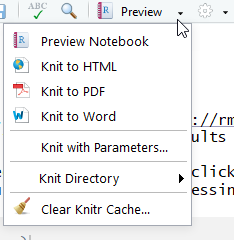
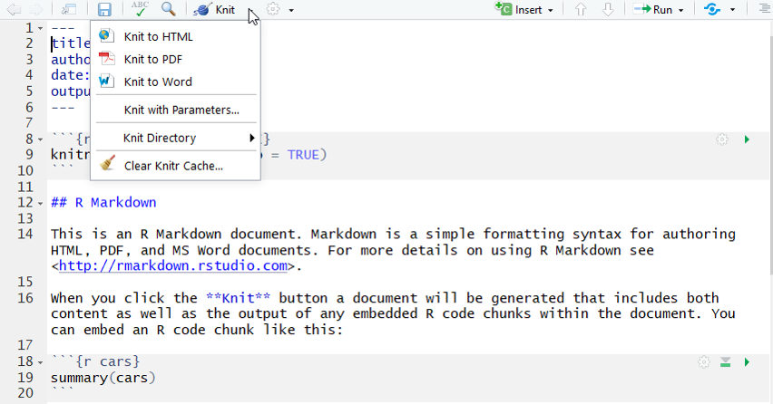

```{r setup, include=FALSE}
knitr::opts_chunk$set(echo = TRUE)
```

#Module 7 Goals
- Types of file formats used by R
- R-Markdown
- Publishing documents
- Shiny apps
- Tufte and tufte handbooks
# R has many different formats
We have been using R Script (Source)


#R Notebook
- Combines Text and Code and results
- Use Markup language
- Easier version of HTML
- Cheat Sheet(s)!

#Run chunk 1

#Many ways to Run

#Can preview document

 
#Preview

#Publish


#Publish Details


You will probably need to setup account

#Published!


#You can republish updates.


#Can output multiple formats

#R Markdown

#Can make presentations


#Knitr makes the presentation

#Shiny are interactive html apps

#Interactive HTML and R

#Install tufte


#Can make handbooks based on style of Edward Tufte

#Create a Tufte Handout

#Tufte Book/Handout

#Tufte HTML

#R Documentation


